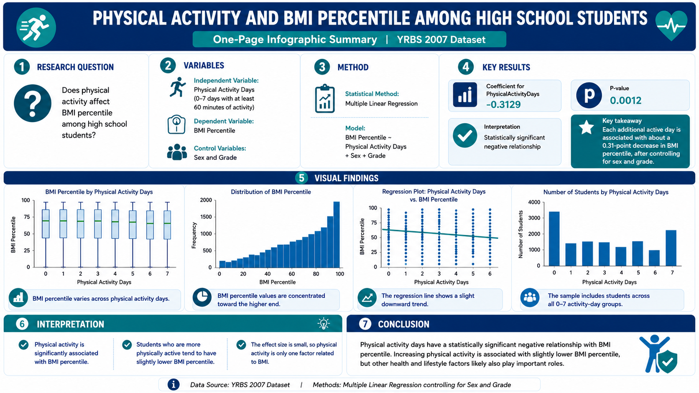

# 2026 Spring Statistics II Final Project

## Student Information

Name:陳冠維  
Student ID:112370128  

## Project Title

**Physical Activity and BMI Percentile Among High School Students**

## Research Question

Does physical activity affect BMI percentile among high school students?

This project studies whether students who are physically active more often tend to have different BMI percentile levels compared with students who are less physically active.

## Dataset

This project uses the **YRBS 2007 Dataset**.

YRBS stands for **Youth Risk Behavior Survey**. The dataset includes survey responses from high school students about health behaviors, physical activity, BMI-related variables, and demographic information.

## Variables

| Variable | Description | Role |
|---|---|---|
| PhysicalActivityDays | Number of days students were physically active for at least 60 minutes during the past 7 days | Independent variable |
| BMIPercentile | BMI percentile by age and sex | Dependent variable |
| Sex | Student's sex | Control variable |
| Grade | Student's grade level | Control variable |

## Data Cleaning

The original dataset was cleaned before analysis.

The main data cleaning steps included:

1. Loading the original YRBS 2007 CSV file.
2. Selecting only the variables needed for this project.
3. Removing missing values.
4. Recoding the physical activity variable from survey codes into actual active days.
5. Recoding sex and grade into readable labels.
6. Saving the cleaned dataset as a processed CSV file.

In the original dataset, the physical activity variable used codes from 1 to 8. These codes represent 0 to 7 active days, so a new variable called `PhysicalActivityDays` was created by subtracting 1 from the original value.

## Statistical Method

This project uses **Multiple Linear Regression**.

The regression model is:

```text
BMI Percentile ~ Physical Activity Days + Sex + Grade
```

Multiple linear regression was used because the dependent variable, BMI percentile, is a continuous variable. Sex and grade were included as control variables.

## Key Results

The multiple linear regression result shows that `PhysicalActivityDays` is statistically significantly associated with BMI percentile.

| Variable | Coefficient | P-value |
|---|---:|---:|
| PhysicalActivityDays | -0.3129 | 0.0012 |

Because the p-value is less than 0.05, the relationship is statistically significant.

## Interpretation

The coefficient of `PhysicalActivityDays` is **-0.3129**.

This means that for each additional day of physical activity, BMI percentile decreases by about **0.31 points** on average, after controlling for sex and grade.

The p-value is **0.0012**, which is less than 0.05. Therefore, physical activity days have a statistically significant relationship with BMI percentile.

Since the coefficient is negative, students who are more physically active tend to have slightly lower BMI percentile.

However, the effect size is small. This means physical activity is related to BMI percentile, but it is not the only factor that affects BMI.

## Conclusion

This project found that physical activity days have a statistically significant negative relationship with BMI percentile among high school students.

Students who are physically active more often tend to have slightly lower BMI percentile. However, other health and lifestyle factors, such as diet, sleep, sex, grade, and daily habits, may also affect BMI percentile.

Overall, this project demonstrates a complete statistical workflow, including research question design, data cleaning, exploratory data analysis, regression analysis, visualization, interpretation, and conclusion.

## One-Page Infographic Summary



## Project Structure

```text
2026-Spring-Stat-2-Final-Project/
│
├── data/
│   ├── data raw/
│   │   └── YRBS_2007.csv
│   │
│   └── data processed/
│       └── cleaned_yrbs_physical_activity_bmi.csv
│
├── notebook/
│   ├── 01_data_cleaning.ipynb
│   ├── 02_eda.ipynb
│   └── 03_regression.ipynb
│
├── output/
│   ├── figures/
│   │   ├── bmi_percentile_distribution.png
│   │   ├── bmi_by_physical_activity_days.png
│   │   ├── students_by_physical_activity_days.png
│   │   └── regression_physical_activity_bmi.png
│   │
│   ├── tables/
│   │   ├── descriptive_statistics.csv
│   │   └── missing_values.csv
│   │
│   └── regression/
│       ├── simple_regression_summary.txt
│       ├── multiple_regression_summary.txt
│       └── multiple_regression_coefficients.csv
│
├── summary.png
└── README.md
```

## Output Files

### Figures

The main figures are saved in:

```text
output/figures/
```

These figures include:

- BMI percentile distribution
- BMI percentile by physical activity days
- Number of students by physical activity days
- Regression plot of physical activity days and BMI percentile

### Tables

The descriptive statistics and missing value checking results are saved in:

```text
output/tables/
```

### Regression Results

The regression summaries and coefficient table are saved in:

```text
output/regression/
```

## Project Repository

https://github.com/jason20041107/2026-Spring-Stat-2-Final-Project

## Presentation Video

https://youtu.be/wBdrnBOFSHc